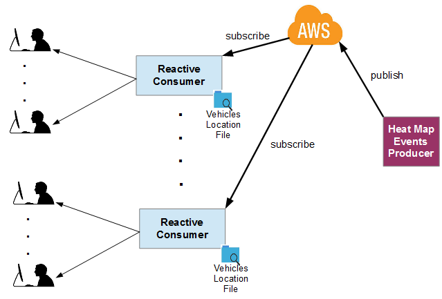

# Denis map-test Reactive AWS Consumer 2018
Massively scalable test map reactive application developed with Spring Boot, Reactor and the newly released AWS Asynchronous SQS (Simple Queue Service) and SNS (Simple Notification Service) API.
 MAP_KEY environment variable must be set with the LocationIQ map token.
 
 
 
 
A small application that updates the UK map based on 2 independent continuous streams of events:  
1) around 20000 risk areas (Heat map) updated every 10 seconds for 2 minutes (reload required to keeping tracking afterwards).
2) 100 moving vehicles updated every 2 seconds.

The risk areas are generated by the companion application "Denis map-test AWS Supplier" and transmitted asynchronously via AWS SNS and SQS services (producer-consumer pattern).

*server command line:
=====================
MAP_KEY=&ltmap_key&gt AWS_REGION=&ltregion&gt AWS_ACCESS_KEY_ID=&ltaws_key&gt AWS_SECRET_ACCESS_KEY=&ltaws_secret&gt java -jar build/libs/denis-map-test_aws_reactive_consumer-1.0.0.jar {lab} {vehicles} {rate} {inputFile}
 *Lab = Type of simulation. Valid Values: 1, 2, both. Default: both
 *Vehicles = Number of vehicles to track. Defaul: 10
 *Rate = Vehicles real refresh interval in seconds. Default: 60
 *inputFile = Name of the file containing the vehicles' positions. Default: ./files/realtimelocation.csv
 *example: java -jar build/libs/heatmap-aws_consumer-1.0.0.jar both 100 2 ./files/realtimelocation.csv

*Client URL:
============
localhost:8080

*Cloud URL:
===========
http://map-test-aws-reactive-consumer.cfapps.io/

*Architectural Decisions:
=========================
1) Event-driven non-blocking architecture (EDA) chosen rather than one-thread-per-connection model. I have opted for implementing this sample application using Reactor because all that must be done is handling data streams. For such I/O-bound scenarios, EDA are massive scalable whilst being lightweight.

2) Push notifications using WebSockets. I believe only WebSockets (or Server-Sent Events) are viable options to meet the UI update rate required.

3) Binary protocol. Data in binary format is transferred among clients and server to optmise the bandwidth.

